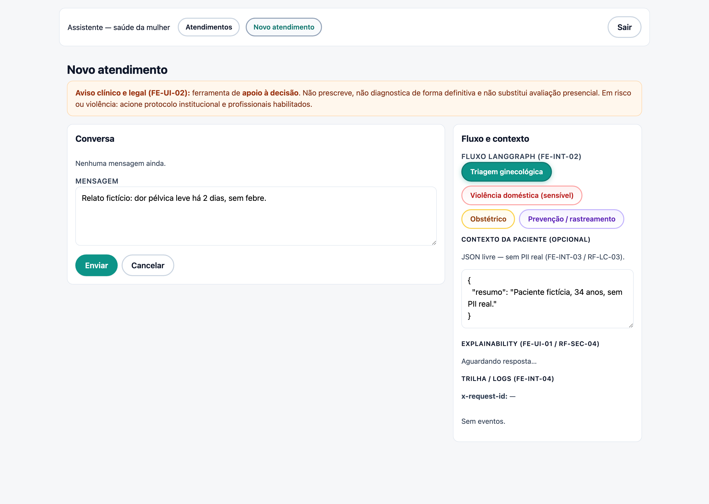
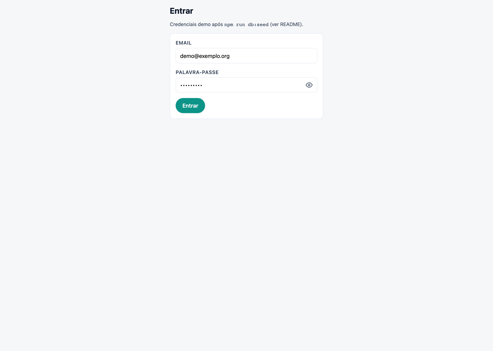
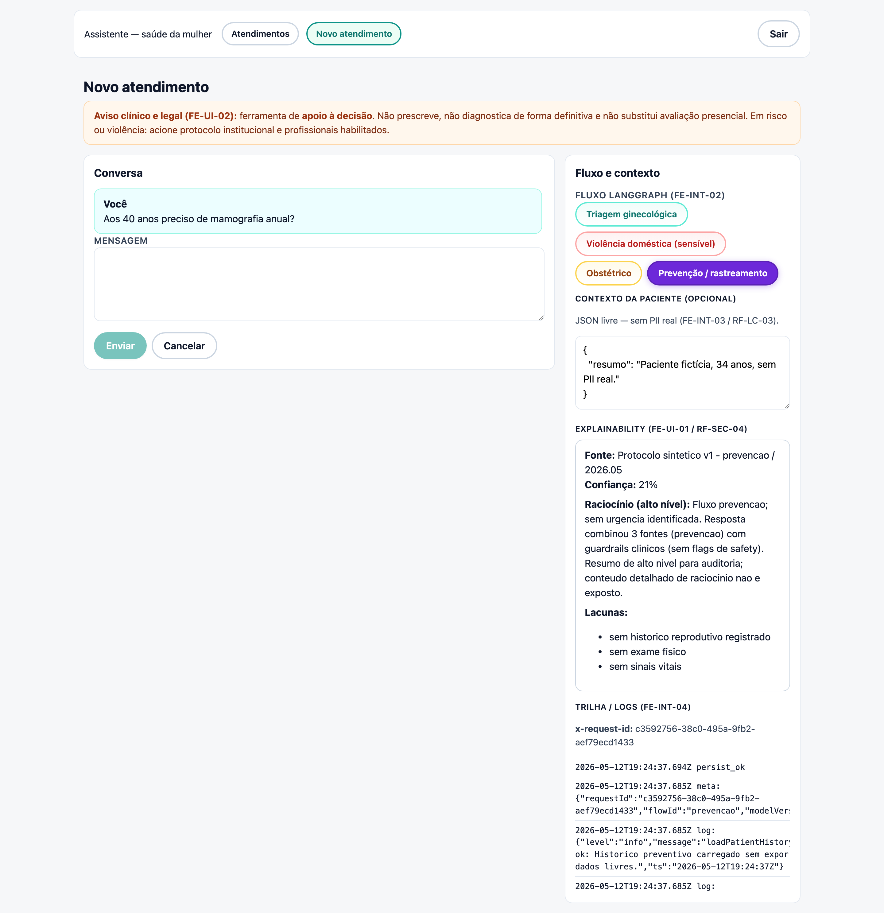
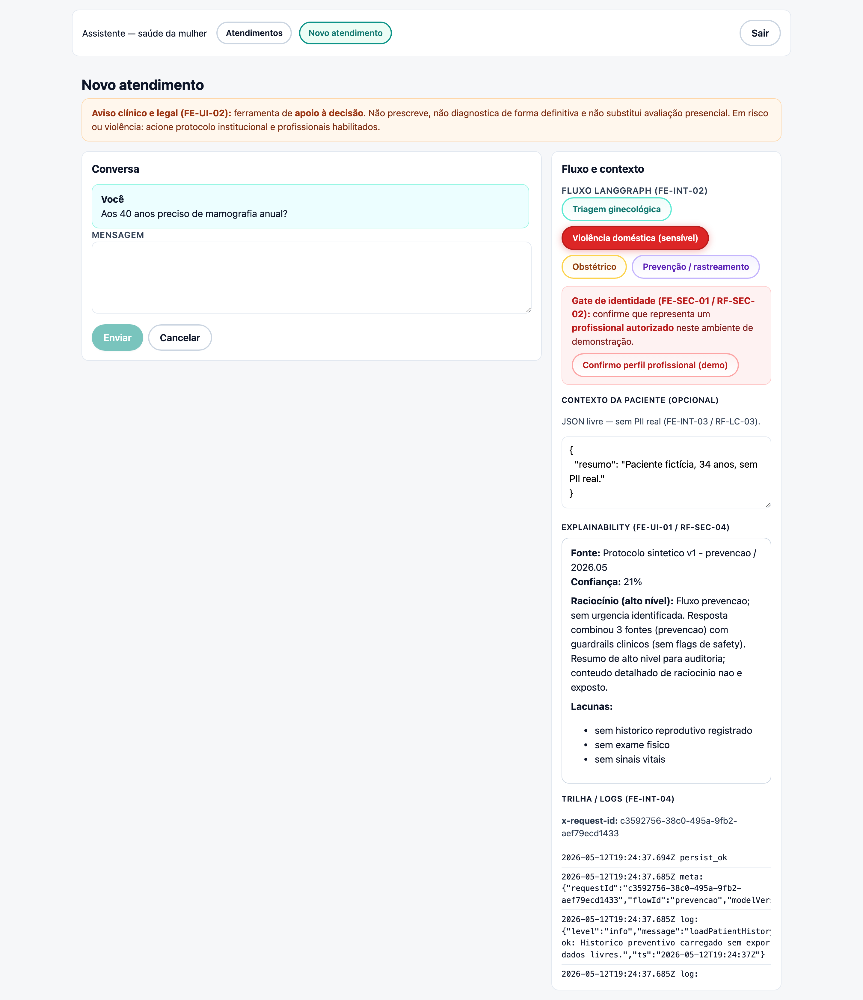
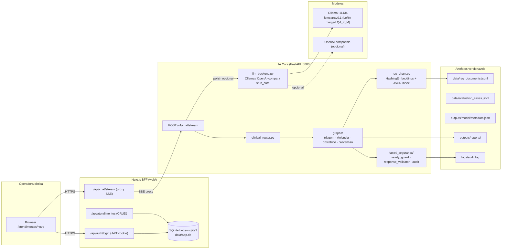

# FemCare IA Core — Tech Challenge Fase 3 (8IADT)

> Assistente clínico em **saúde da mulher** com pipeline completo de dados, fine-tuning, RAG, LangGraph, guardrails e UI funcional. Entrega acadêmica do **Tech Challenge Fase 3** da pós-graduação 8IADT.

[](docs/sdd/ia-core/tasks.md)
[](https://github.com/vinicius707/tech-challenge-fase-3-8IADT/releases/tag/ia-core-phase-h-v0.1)
[](outputs/reports/avaliacao.md)
[](#16-cr%C3%A9ditos-e-licen%C3%A7as)



## Sumário

1. [Visão geral](#1-visão-geral)
2. [Demo em imagens](#2-demo-em-imagens)
3. [Arquitetura](#3-arquitetura)
4. [Pré-requisitos](#4-pré-requisitos)
5. [Setup rápido (modo `stub`, sem Python)](#5-setup-rápido-modo-stub-sem-python)
6. [Setup completo (modo `proxy`, três terminais)](#6-setup-completo-modo-proxy-três-terminais)
7. [Variáveis de ambiente](#7-variáveis-de-ambiente)
8. [Estrutura do repositório](#8-estrutura-do-repositório)
9. [Como usar a solução](#9-como-usar-a-solução)
10. [Fluxos LangGraph implementados](#10-fluxos-langgraph-implementados)
11. [Guardrails clínicos e auditoria](#11-guardrails-clínicos-e-auditoria)
12. [RAG, dataset e fine-tuning](#12-rag-dataset-e-fine-tuning)
13. [Avaliação automatizada](#13-avaliação-automatizada)
14. [Problemas conhecidos e troubleshooting](#14-problemas-conhecidos-e-troubleshooting)
15. [Mapa completo da documentação](#15-mapa-completo-da-documentação)
16. [Créditos e licenças](#16-créditos-e-licenças)

## 1. Visão geral

O **FemCare IA Core** é a entrega final do Tech Challenge Fase 3 (8IADT). O projeto evoluiu de uma UI Next.js com stub para uma **stack ponta a ponta**: pipeline de dados curado a partir do MedQuAD, fine-tuning LoRA real do Llama-3.2-1B, RAG sobre fontes versionadas, quatro fluxos LangGraph clínicos, guardrails declarativos em YAML, auditoria minimizada, avaliação automatizada e UI Next.js com SSE em modo proxy.

A entrega cobre os cinco itens obrigatórios do PDF Secretaria (p. 7):

- **Pipeline de fine-tuning** — [`fase2_finetuning/train_lora.py`](fase2_finetuning/train_lora.py) + [`fase2_finetuning/FemCare_FineTuning_Colab.ipynb`](fase2_finetuning/FemCare_FineTuning_Colab.ipynb).
- **Integração LangChain** — RAG sobre `data/rag_documents.jsonl` em [`fase3_orquestracao/rag_chain.py`](fase3_orquestracao/rag_chain.py).
- **Fluxos LangGraph** — quatro grafos em [`fase3_orquestracao/graphs/`](fase3_orquestracao/graphs/).
- **Dataset anonimizado/sintético** — corpus curado em [`data/synthetic/womens_health_curated.jsonl`](data/synthetic/womens_health_curated.jsonl), pipeline em [`fase1_dados/`](fase1_dados/).
- **Módulos de segurança e validação** — [`config/safety_rules.yaml`](config/safety_rules.yaml) + [`fase4_seguranca/`](fase4_seguranca/).

### O que diferencia esta entrega

| Tema | Como foi resolvido |
|---|---|
| **Resposta clínica nunca depende só do LLM** | Cada grafo aplica `SafetyGuard` na entrada, RAG-first, `ResponseValidator` na saída e `LlmBackend.generate()` apenas como "polish" controlado (com fallback determinístico). |
| **Privacidade e LGPD** | Logs JSON Lines minimizados; conteúdo livre de violência doméstica é redigido (`audit_summary.sensitive_redacted=true`). |
| **Reprodutibilidade** | Hashes SHA-256 dos splits em [`outputs/model/metadata.json`](outputs/model/metadata.json); benchmark gera [`outputs/reports/avaliacao.md`](outputs/reports/avaliacao.md) versionado. |
| **Custo zero na demo** | Modelo fine-tuned servido localmente no Ollama (`femcare:v0.1`, Q4_K_M, 807 MB). |
| **Entrega acadêmica auditável** | [`CHECKLIST_FASE3.md`](CHECKLIST_FASE3.md) referencia cada requisito do PDF e SDD com arquivo/comando associado. |

### Números reais desta entrega

| Métrica | Valor | Origem |
|---|---:|---|
| Casos de avaliação versionados | **20** (5 por fluxo) | [`data/evaluation_cases.jsonl`](data/evaluation_cases.jsonl) |
| Pass rate (safety / RAG / LangGraph / resposta) | **100% / 100% / 100% / 100%** | [`outputs/reports/avaliacao.md`](outputs/reports/avaliacao.md) |
| Latência média / p95 (in_process) | **2 243.79 ms / 2 904.58 ms** | [`outputs/reports/benchmark_results.json`](outputs/reports/benchmark_results.json) |
| Registros normalizados (Fase B) | **16 358** | [`outputs/reports/data_validation.md`](outputs/reports/data_validation.md) |
| Documentos RAG | **13 355** | `data/rag_documents.jsonl` |
| Exemplos de treino / validação | **2 231 / 557** | `data/train.jsonl` / `data/val.jsonl` |
| `train_loss` / `eval_loss` (LoRA real) | **1.229 / 1.192** | [`outputs/model/metadata.json`](outputs/model/metadata.json) |
| Modelo servido | `ollama:femcare:v0.1` | Ollama runtime |

## 2. Demo em imagens

Todos os prints foram capturados com `femcare:v0.1` servindo o tráfego (`modelVersion: "ollama:femcare:v0.1"` no SSE). Receita de captura automatizada em [`docs/sdd/ia-core/README.md`](docs/sdd/ia-core/README.md) §"Como regenerar os prints".

### 2.1 Login

Após `npm run setup:local`, o BFF cria o usuário demo (`demo@exemplo.org` / `demo12345`). A página `/login` faz POST para `/api/auth/login` e grava o cookie `mw_session` (JWT HS256, `HttpOnly`).



### 2.2 Novo atendimento (modo proxy ativo)

`/atendimentos/novo` mostra o disclaimer clínico, o seletor de fluxo LangGraph, área de mensagem, contexto livre em JSON, painel de **Explainability** e **Logs**. Quando `/api/health` retorna `mode:"proxy"`, a UI direciona o stream para o IA Core na porta 8000.


### 2.3 Streaming SSE em andamento

Ao selecionar o chip **Prevenção / rastreamento** e enviar a pergunta, a UI recebe a sequência de eventos prevista no contrato da Fase G (`meta`, `log`, `token`, `explain`, `trace`, `done`). O print mostra o streaming acontecendo (botão **Cancelar** habilitado, logs `info` por nó do LangGraph).



### 2.4 Estado final com explainability e trace

Quando o stream termina, o painel **Explainability** é preenchido com `fonte` (Protocolo prevenção 2026), `confiança`, **lacunas** (resumo clínico ausente, histórico de exames, sinais vitais) e **raciocínio clínico** em alto nível (sem chain-of-thought). O painel de **Logs** mostra `x-request-id` e o evento `trace` com a lista dos nodes do grafo.


### 2.5 Gate de identidade no fluxo de violência doméstica

Selecionar o chip **Violência doméstica** ativa o gate FE-SEC-01 / RF-SEC-02: o envio fica bloqueado até confirmação explícita de perfil profissional. O grafo correspondente minimiza logs e força encaminhamento humano via [`config/safety_rules.yaml`](config/safety_rules.yaml) (regra `domestic_violence`) + [`fase3_orquestracao/graphs/violencia_domestica.py`](fase3_orquestracao/graphs/violencia_domestica.py).



## 3. Arquitetura

Visão de processos (deployed components). Detalhe completo, com diagramas de sequência, módulos Python e pipelines de dados/fine-tuning, em [`docs/diagrama_arquitetura.md`](docs/diagrama_arquitetura.md).



**Decisões arquiteturais** ([`docs/sdd/ia-core/context.md`](docs/sdd/ia-core/context.md) §5):

- **D1** — Manter Next.js como UI+BFF (sem reescrita).
- **D3** — SSE end-to-end.
- **D4** — Quatro grafos LangGraph **separados** para rastreabilidade.
- **D7** — `LlmBackend` pluggable.
- **D8** — Corpus base MedQuAD via Kaggle.
- **D9** — Ollama local como default (sem custo de API, sem chave externa).

## 4. Pré-requisitos

| Item | Versão sugerida | Como instalar |
|---|---|---|
| Python | **3.12+** | `pyenv install 3.12` ou `brew install python@3.12` |
| Node.js | **20+** | `nvm install 20` ou `brew install node@20` |
| Ollama (modo `proxy`) | `>=0.1.40` | <https://ollama.com/download> |
| Git LFS | opcional, para clones com Release de LoRA | `brew install git-lfs` |
| `kagglehub` | já em [`requirements.txt`](requirements.txt) | `pip install kagglehub` |
| Acesso ao Kaggle (opcional) | conta gratuita | <https://www.kaggle.com/account/login> |
| Acesso ao Hugging Face (opcional, treino LoRA) | conta gratuita | `huggingface-cli login` |

> **Sem Ollama nem Python?** A UI Next.js roda em modo `stub` (resposta sintética determinística). Veja a [seção 5](#5-setup-rápido-modo-stub-sem-python).

## 5. Setup rápido (modo `stub`, sem Python)

Use este caminho para conhecer a UI **antes** de instalar Python/Ollama. O BFF detecta `ORCHESTRATION_API_URL` vazio e responde com um stub determinístico que mantém o contrato SSE.

```bash
git clone https://github.com/vinicius707/tech-challenge-fase-3-8IADT.git
cd tech-challenge-fase-3-8IADT/web
npm install
npm run setup:local       # cria SQLite + usuário demo
npm run dev               # http://localhost:3000
```

Login: `demo@exemplo.org` / `demo12345`. O painel de logs vai mostrar `modelVersion: "stub-0.1.0"` — sinal claro de que a IA real ainda não está conectada.

```bash
curl -s http://127.0.0.1:3000/api/health
# {"ok":true,"mode":"stub"}
```

## 6. Setup completo (modo `proxy`, três terminais)

Caminho recomendado para a demo final e para reproduzir as métricas do `outputs/reports/avaliacao.md`. São três terminais (Ollama, IA Core Python, BFF Next.js) e uma única configuração de variáveis de ambiente.

### 6.1 Clonar, ambiente Python e dependências

```bash
git clone https://github.com/vinicius707/tech-challenge-fase-3-8IADT.git
cd tech-challenge-fase-3-8IADT
python -m venv .venv
source .venv/bin/activate
python -m pip install --upgrade pip
python -m pip install -r requirements.txt
```

### 6.2 (Opcional) Baixar o adapter LoRA e importar no Ollama

Caso queira a "voz" fine-tuned (`femcare:v0.1`). Se preferir só validar a arquitetura, pule para a 6.3 com `OLLAMA_MODEL=llama3.2:3b`.

```bash
# 1. baixar adapter como asset do GitHub Release (sha256 verificavel em metadata.json)
mkdir -p outputs/model
curl -L \
  https://github.com/vinicius707/tech-challenge-fase-3-8IADT/releases/download/ia-core-phase-h-v0.1/femcare-lora-v0.1.tar.gz \
  | tar -xzf - -C outputs/model

# 2. merge + GGUF + import no Ollama: receita completa em docs/fine-tuning.md secao 6
# Resumo:
ollama list           # esperado: femcare:v0.1 (Q4_K_M, ~807 MB)
```

Receita reproduzível em [`docs/fine-tuning.md` §6](docs/fine-tuning.md).

### 6.3 Terminal 1 — Ollama

```bash
# se ainda nao tiver baixado o modelo base
ollama pull llama3.2:3b      # ou outro modelo compatível

# confirmar
ollama list
```

### 6.4 Terminal 2 — IA Core (Python)

```bash
source .venv/bin/activate

IA_LLM_BACKEND=ollama \
OLLAMA_MODEL=femcare:v0.1 \
OLLAMA_BASE_URL=http://127.0.0.1:11434 \
OLLAMA_API_KEY=ollama \
.venv/bin/uvicorn fase3_orquestracao.app:app --port 8000
```

> `OLLAMA_BASE_URL` aceita tanto `http://127.0.0.1:11434` quanto `http://127.0.0.1:11434/v1`. O sufixo `/v1` é anexado automaticamente quando ausente (lógica em [`fase3_orquestracao/llm_backend.py`](fase3_orquestracao/llm_backend.py)).

Validar:

```bash
curl -s http://127.0.0.1:8000/health
# {"ok":true,"service":"ia-core","version":"0.1.0"}
```

Teste manual do contrato SSE:

```bash
curl -N -H 'Content-Type: application/json' \
  -d '{"flowId":"prevencao","messages":[{"role":"user","content":"Tenho 42 anos, ultima mamografia ha 3 anos."}]}' \
  http://127.0.0.1:8000/v1/chat/stream
```

Os primeiros eventos devem ser `meta` (com `modelVersion` começando por `ollama:`) seguidos de `log`, `token`, `explain`, `trace` e `done`.

### 6.5 Terminal 3 — BFF Next.js em modo `proxy`

```bash
cd web
npm install
npm run setup:local       # migrate + seed
ORCHESTRATION_API_URL=http://127.0.0.1:8000 npm run dev
```

Validar:

```bash
curl -s http://127.0.0.1:3000/api/health
# {"ok":true,"mode":"proxy"}     # NUNCA stub aqui
```

Abrir `http://127.0.0.1:3000`, logar e seguir o fluxo da seção 9.

## 7. Variáveis de ambiente

### 7.1 BFF Next.js (`web/`)

| Variável | Obrigatória | Default | Descrição |
|---|---|---|---|
| `AUTH_SECRET` | **Sim em prod / CI** | `.env` demo | Segredo JWT (≥ 32 chars) para o cookie `mw_session`. |
| `DATABASE_PATH` | Não | `data/app.db` | Caminho do SQLite (relativo ao cwd do processo `web/`). |
| `ORCHESTRATION_API_URL` | Não | (vazio = stub) | URL base do IA Core (ex.: `http://127.0.0.1:8000`). |
| `ORCHESTRATION_API_KEY` | Não | - | Bearer opcional para ambientes fechados. |
| `NEXT_PUBLIC_SITE_URL` | Não | - | URL pública para `metadataBase` / sitemap / robots. |

Detalhes adicionais em [`web/README.md`](web/README.md) e [`docs/api.md`](docs/api.md).

### 7.2 IA Core Python

| Variável | Default | Descrição |
|---|---|---|
| `IA_LLM_BACKEND` | `ollama` | Seleciona backend (`ollama`, `openai_compatible`, `stub_safe`). |
| `IA_LLM_POLISH` | `auto` | Liga o polish via LLM real. `0`/`off` desliga (resposta vem só do LangGraph). |
| `IA_LLM_POLISH_TIMEOUT_S` | `45` | Timeout (s) do polish; em estouro, fallback determinístico. |
| `IA_LLM_POLISH_TEMPERATURE` | `0.2` | Temperatura do LLM no polish. |
| `OLLAMA_BASE_URL` | `http://127.0.0.1:11434/v1` | Aceita com ou sem `/v1`. |
| `OLLAMA_MODEL` | `llama3.2:3b` (demo: `femcare:v0.1`) | Modelo Ollama servido. |
| `OLLAMA_API_KEY` | `ollama` | Token simbólico aceito pelo Ollama. |
| `OPENAI_BASE_URL` / `OPENAI_API_KEY` / `OPENAI_MODEL` | - | Backend opcional. |
| `ORCHESTRATION_API_KEY` | - | Bearer **esperado** pelo IA Core quando o BFF mandar; sem ele, autenticação é desligada. |

Os mesmos valores podem ser definidos via [`config/model_backends.yaml`](config/model_backends.yaml). Detalhes em [`docs/llm-backends.md`](docs/llm-backends.md).

## 8. Estrutura do repositório

```text
.
├── CHECKLIST_FASE3.md              <- mapa de evidências (IA-J1)
├── README.md                        <- este documento
├── config/
│   ├── safety_rules.yaml            <- regras YAML do SafetyGuard
│   └── model_backends.yaml          <- backends LLM e defaults
├── data/
│   ├── evaluation_cases.jsonl       <- 20 cenários sintéticos (versionado)
│   ├── synthetic/                   <- corpus curado (versionado)
│   ├── raw/                         <- cache MedQuAD (.gitignored)
│   ├── processed/                   <- medquad_normalized.jsonl (gerado)
│   ├── rag_documents.jsonl          <- corpus RAG (gerado)
│   ├── train.jsonl / val.jsonl      <- splits de fine-tuning (gerados)
├── docs/
│   ├── api.md                       <- contrato HTTP BFF <-> IA Core
│   ├── dados-e-curadoria.md         <- fontes da Fase B
│   ├── diagrama_arquitetura.md      <- arquitetura final (IA-J3)
│   ├── diagramas_fluxos.md          <- 4 fluxos LangGraph (IA-J4)
│   ├── fine-tuning.md               <- Fase H ponta a ponta
│   ├── llm-backends.md              <- Fase D + polish LLM
│   ├── relatorio_tecnico.md         <- relatório técnico (IA-J2)
│   ├── roteiro_video.md             <- roteiro (IA-J5), até 15 min
│   ├── sdd/ia-core/                 <- pacote SDD (context/spec/design/tasks)
│   │   └── assets/                  <- prints da demo
│   └── specs/                       <- requisitos TLC (PDF Secretaria)
├── fase1_dados/                     <- pipeline Fase B (download/normalize/build/validate)
├── fase2_finetuning/                <- LoRA/QLoRA (Fase H)
├── fase3_orquestracao/              <- Fases A, C, D, F, G
│   ├── app.py                       <- FastAPI factory
│   ├── chat_stream.py               <- POST /v1/chat/stream (SSE)
│   ├── clinical_router.py           <- roteamento por flowId
│   ├── graphs/                      <- triagem · violencia · obstetrico · prevencao
│   ├── graph_helpers.py             <- estado tipado + trace seguro
│   ├── llm_backend.py               <- Ollama / OpenAI-compat / stub_safe
│   ├── rag_chain.py                 <- LangChain RAG
│   ├── schemas.py                   <- Pydantic
│   └── sse.py                       <- helpers SSE
├── fase4_seguranca/                 <- safety_guard / response_validator / explainability / audit
├── fase5_avaliacao/                 <- safety_tests / graph_tests / benchmark / generate_report
├── outputs/
│   ├── model/metadata.json          <- evidência LoRA (versionada)
│   ├── vectorstore/rag_index.json   <- índice RAG (gerado)
│   └── reports/                     <- data_validation.md, avaliacao.md, benchmark_results.json
├── logs/                            <- audit.log (runtime, .gitignored)
├── tests/                           <- pytest da IA Core
├── web/                             <- BFF + UI Next.js (App Router)
│   ├── app/                         <- Server Components + APIs
│   ├── scripts/                     <- migrate / seed
│   └── README.md                    <- referência específica do web
├── requirements.txt                 <- IA Core
└── requirements-finetuning.txt      <- treino LoRA (opcional)
```

## 9. Como usar a solução

### 9.1 Jornada da operadora clínica (UI)

1. Acessar `http://127.0.0.1:3000` e logar com `demo@exemplo.org` / `demo12345`.
2. Em `/atendimentos/novo`, escolher um dos quatro fluxos (chips). Os fluxos sensíveis exibem um gate de confirmação profissional antes de enviar.
3. (Opcional) Preencher o contexto clínico como JSON (exemplo abaixo).
4. Enviar a pergunta e acompanhar o **streaming SSE** em tempo real.
5. Acompanhar os painéis lateriais: **Explainability** (fonte, confiança, lacunas, raciocínio) e **Logs** (`x-request-id`, eventos por nó do LangGraph, evento `trace`).
6. O atendimento é gravado no SQLite via `POST /api/atendimentos`. Ver a lista em `/atendimentos` e o detalhe em `/atendimentos/[id]`.

**Exemplo de `patientContext` para o fluxo Prevenção:**

```json
{
  "resumo": "Paciente fictícia de 42 anos, mãe com câncer de mama aos 50.",
  "preventivos": { "ultimaMamografia": "2023" },
  "historicoReprodutivo": { "menarcaAnos": 12, "menopausa": false }
}
```

Pergunta sugerida: *"Tenho 42 anos e a minha mãe teve câncer de mama aos 50. Última mamografia há 3 anos. O que devo fazer agora?"*

### 9.2 Uso direto da API (sem UI)

```bash
curl -N -H 'Content-Type: application/json' \
     -H 'x-request-id: 11111111-2222-3333-4444-555555555555' \
     -d '{
       "flowId": "obstetrico",
       "messages": [{"role":"user","content":"Estou com 32 semanas e tive sangramento intenso."}],
       "patientContext": {"obstetrica":{"idadeGestacionalSemanas":32}}
     }' \
     http://127.0.0.1:8000/v1/chat/stream
```

Eventos esperados, em ordem:

```
event: meta     { requestId, flowId, modelVersion: "ollama:femcare:v0.1", urgencia: "emergencia" }
event: log      { level: "info", message: "ingestPregnancyData ok", ts: ... }
event: log      { ... }
event: token    { delta: "Sinais de alarme..." }
event: explain  { fonte, confianca, lacunas, raciocinioClinico }
event: trace    { flowId, nodes: [...], finalRisk: "emergencia" }
event: done     {}
```

Contrato completo em [`docs/api.md`](docs/api.md).

### 9.3 Rodar a avaliação automatizada localmente

```bash
source .venv/bin/activate

python fase1_dados/validate_data.py        # gate de dados (Fase B + Fase I)
python fase5_avaliacao/safety_tests.py     # safety
python fase5_avaliacao/graph_tests.py      # 4 fluxos LangGraph, 5 casos cada
python fase5_avaliacao/benchmark.py        # outputs/reports/benchmark_results.json
python fase5_avaliacao/generate_report.py  # outputs/reports/avaliacao.md
```

Para validar o contrato SSE end-to-end contra a IA Core rodando:

```bash
ORCHESTRATION_API_URL=http://127.0.0.1:8000 \
python fase5_avaliacao/benchmark.py --via-http
```

## 10. Fluxos LangGraph implementados

Diagramas detalhados em [`docs/diagramas_fluxos.md`](docs/diagramas_fluxos.md). Resumo:

| `flowId` | Estados principais | Sinais críticos detectados | Onde |
|---|---|---|---|
| `triagemGinecologica` | `collectSymptoms → analyzeRisk → classifyUrgency → suggestExams \| emergencyGuidance → initialGuidance → scheduleAppointment → validate` | dor pélvica, sangramento, corrimento, ciclo irregular, alarmes `clinical_emergency` | [`graphs/triagem_ginecologica.py`](fase3_orquestracao/graphs/triagem_ginecologica.py) |
| `violenciaDomestica` | `captureAlertSignals → assessViolenceRisk → applySafetyProtocol → notifySpecializedTeam → secureDocumentation → followUpPlan → validate` | regra `domestic_violence`, encaminhamento humano obrigatório, logs minimizados | [`graphs/violencia_domestica.py`](fase3_orquestracao/graphs/violencia_domestica.py) |
| `obstetrico` | `ingestPregnancyData → assessObstetricRisk → specificGuidance → scheduleObstetricExams → urgencyAlerts → continuousSupport → validate` | sangramento intenso, "não sinto mais o bebê", bolsa rota, convulsão, pressão muito alta | [`graphs/obstetrico.py`](fase3_orquestracao/graphs/obstetrico.py) |
| `prevencao` | `loadPatientHistory → identifyDueExams → preventiveGuidance → autoSchedulePrevention → personalizedReminders → validate` | separa **rastreamento de rotina** vs **investigação por sintoma** vs **alto risco familiar** | [`graphs/prevencao.py`](fase3_orquestracao/graphs/prevencao.py) |

Roteamento por `flowId` em [`fase3_orquestracao/clinical_router.py`](fase3_orquestracao/clinical_router.py). Helpers compartilhados (estado tipado, trace seguro, RAG opcional) em [`fase3_orquestracao/graph_helpers.py`](fase3_orquestracao/graph_helpers.py).

## 11. Guardrails clínicos e auditoria

Filosofia: **safety e fluxo não podem depender exclusivamente do LLM**. Regras declarativas em YAML, aplicadas em três momentos (input, transições do grafo, output) — detalhe em [`docs/relatorio_tecnico.md` §4](docs/relatorio_tecnico.md#4-seguranca-explainability-e-auditoria).

| Regra | Categoria | Ação | Flags emitidas |
|---|---|---|---|
| `prescription_request` | prescrição | `block_with_human_review` | `prescription_blocked`, `human_review_required` |
| `definitive_diagnosis` | diagnóstico | `rewrite_with_uncertainty` | `definitive_diagnosis_blocked`, `human_review_required` |
| `self_harm` | autoagressão | `crisis_escalation` (CVV 188, SAMU 192) | `self_harm_escalation`, `human_review_required`, `sensitive` |
| `domestic_violence` | violência | `violence_protocol` (Disque 180, Polícia 190, Casa da Mulher Brasileira) | `violence_protocol`, `human_review_required`, `sensitive` |
| `obstetric_emergency` | urgência | `urgency_escalation` | `obstetric_emergency`, `urgent_referral`, `human_review_required` |
| `clinical_emergency` | urgência | `urgency_escalation` (dor torácica, AVC, infarto…) | `clinical_emergency`, `urgent_referral`, `human_review_required` |

Configuração: [`config/safety_rules.yaml`](config/safety_rules.yaml). Implementação: [`fase4_seguranca/safety_guard.py`](fase4_seguranca/safety_guard.py), [`fase4_seguranca/response_validator.py`](fase4_seguranca/response_validator.py).

**Auditoria minimizada** em [`fase4_seguranca/audit.py`](fase4_seguranca/audit.py). Cada requisição produz uma linha JSON em `logs/audit.log`:

```jsonc
{
  "ts": "2026-05-12T20:21:01Z",
  "request_id": "5ad8c1a8-...",
  "flow_id": "violenciaDomestica",
  "model_version": "ollama:femcare:v0.1",
  "sources_count": 3,
  "safety_flags": ["violence_protocol", "human_review_required", "sensitive"],
  "urgency": "alta",
  "blocked": false,
  "sensitive_redacted": true,
  "duration_ms": 1380
}
```

Para violência doméstica, `sensitive_redacted=true` e o conteúdo textual livre **não** é persistido.

## 12. RAG, dataset e fine-tuning

### 12.1 Dataset

- Fonte base: **MedQuAD** (`pythonafroz/medquad-medical-question-answer-for-ai-research`), via `kagglehub`.
- 16 358 registros normalizados em `data/processed/medquad_normalized.jsonl`.
- Recorte por domínio: `obstetrico`, `prevencao`, `triagemGinecologica`, `violenciaDomestica`, `medicinaGeral`, `excluir`.
- Complementos sintéticos curados em `data/synthetic/womens_health_curated.jsonl` (versionado).
- Curadoria e licenciamento em [`docs/dados-e-curadoria.md`](docs/dados-e-curadoria.md).

```bash
python fase1_dados/download_medquad.py
python fase1_dados/explore_dataset.py
python fase1_dados/build_dataset.py
python fase1_dados/validate_data.py
```

### 12.2 RAG (LangChain)

- Documentos em `data/rag_documents.jsonl` (13 355 itens com `doc_id/domain/source/version/sensitivity/citation`).
- Índice determinístico (`HashingEmbeddings`) em `outputs/vectorstore/rag_index.json`.
- Função pública: `retrieve_context(query, flow_id, k)` retorna `[{content, citation, score, domain, version}]`.

```bash
python fase3_orquestracao/rag_chain.py --build
python fase5_avaliacao/rag_tests.py
```

### 12.3 Fine-tuning LoRA

Receita completa em [`docs/fine-tuning.md`](docs/fine-tuning.md).

- **Modelo base:** `meta-llama/Llama-3.2-1B-Instruct`.
- **Técnica:** LoRA via `trl.SFTTrainer` (`r=16`, `alpha=32`, `target_modules=[q_proj,k_proj,v_proj,o_proj]`).
- **Hardware:** Apple Silicon MPS detectado automaticamente; `bitsandbytes` não é necessário.
- **Hiperparâmetros reais:** `epochs=2`, `lr=2e-4`, `batch=1`, `grad_accum=2`, `max_seq_length=512`, `cosine`, `bf16=true`, `seed=42`.
- **Métricas reais:** `train_loss=1.229`, `eval_loss=1.192`.
- **Distribuição:** asset do GitHub Release [`ia-core-phase-h-v0.1`](https://github.com/vinicius707/tech-challenge-fase-3-8IADT/releases/tag/ia-core-phase-h-v0.1).
- **Deploy:** GGUF Q4_K_M importado no Ollama como `femcare:v0.1` (807 MB).

Validação rápida:

```bash
python fase2_finetuning/validate_adapters.py
```

## 13. Avaliação automatizada

Resultados versionados em [`outputs/reports/avaliacao.md`](outputs/reports/avaliacao.md) e [`outputs/reports/benchmark_results.json`](outputs/reports/benchmark_results.json).

| Métrica | Valor |
|---|---:|
| Casos totais | **20** (5 por fluxo) |
| Pass rate geral | **100.0%** |
| Safety / RAG / LangGraph / Resposta | **100.0% / 100.0% / 100.0% / 100.0%** |
| Latência média | **2 243.79 ms** |
| Latência p95 | **2 904.58 ms** |

Cobertura por tag (clinical_gap, prescription, urgency, prevention, triagem, violence, obstetric, self_harm) detalhada no relatório.

Re-rodar tudo:

```bash
python fase5_avaliacao/safety_tests.py
python fase5_avaliacao/graph_tests.py
python fase5_avaliacao/benchmark.py
python fase5_avaliacao/generate_report.py
```

## 14. Problemas conhecidos e troubleshooting

### 14.1 Ollama / modelo

| Sintoma | Causa provável | Solução |
|---|---|---|
| `curl -s :8000/v1/chat/stream` devolve `error` antes do primeiro token. | Ollama não está rodando. | `ollama serve` (ou abrir o app). |
| `meta.modelVersion` vem como `stub-0.1.0` na UI. | `IA_LLM_BACKEND` foi resolvido para stub (ex.: env não exportada). | Confirmar `IA_LLM_BACKEND=ollama` antes do `uvicorn`. |
| Latência alta no primeiro request | Ollama carrega o modelo na primeira chamada. | Aquecer com `ollama run femcare:v0.1 "ok"` antes da demo. |
| `OLLAMA_BASE_URL` com `/v1` quebrado em variantes externas | Algumas integrações exigem caminho exato. | Passar `http://host:11434` — o IA Core anexa `/v1` automaticamente. |
| `femcare:v0.1` não aparece em `ollama list` | Modelo ainda não foi importado. | Seguir [`docs/fine-tuning.md` §6.2 e §6.3](docs/fine-tuning.md). |

### 14.2 Python / IA Core

| Sintoma | Causa | Solução |
|---|---|---|
| `ImportError: kagglehub` | venv não ativado ou `requirements.txt` não instalado. | `source .venv/bin/activate && pip install -r requirements.txt`. |
| `RagDataError: data/rag_documents.jsonl ausente` | Fase B nunca foi rodada localmente. | `python fase1_dados/build_dataset.py` (ou `--synthetic-only`) seguido de `python fase3_orquestracao/rag_chain.py --build`. |
| `outputs/model/adapter_model.safetensors not found` ao rodar `validate_adapters.py` | Adapter LoRA não baixado. | `curl -L ... | tar -xzf - -C outputs/model` (ver §6.2) ou rode em `--dry-run`. |
| Polish via LLM travando | Timeout do Ollama acima do default. | `IA_LLM_POLISH_TIMEOUT_S=90` ou `IA_LLM_POLISH=0` para usar só o LangGraph. |
| `pytest` falhando offline | Algum teste tentou conectar ao Ollama. | A suite usa `stub_safe` por default; verifique se `IA_LLM_BACKEND` está overridado no env. |

### 14.3 Next.js / BFF

| Sintoma | Causa | Solução |
|---|---|---|
| `/api/health` retorna `mode:"stub"` mesmo com IA Core rodando | `ORCHESTRATION_API_URL` não chegou ao processo Node. | Exporte **antes** do `npm run dev`: `ORCHESTRATION_API_URL=http://127.0.0.1:8000 npm run dev`. |
| 502 ao enviar mensagem | IA Core caiu ou está em build de RAG. | Conferir log do terminal 2; rodar `python fase3_orquestracao/rag_chain.py --build`. |
| `npm run setup:local` falha em `bcrypt` | Node não compilou módulos nativos. | `nvm install 20 && npm rebuild`. |
| Cookie `mw_session` não persiste | `AUTH_SECRET` < 32 chars ou alterado entre reinícios. | Manter o mesmo segredo (≥ 32 chars). |

### 14.4 Dados

| Sintoma | Causa | Solução |
|---|---|---|
| Download MedQuAD falha sem credenciais Kaggle | `kagglehub` precisa autenticar para datasets restritos. | Configure `~/.kaggle/kaggle.json` ou use `python fase1_dados/build_dataset.py --synthetic-only`. |
| `validate_data.py` acusa duplicatas | Re-execução parcial. | Apague `data/processed/` e `data/rag_documents.jsonl` e refaça `build_dataset.py`. |
| `evaluation_cases.jsonl` desatualizado vs regras YAML | Alteração nas regex de `safety_rules.yaml`. | Reexecute `python fase5_avaliacao/safety_tests.py` e atualize expectations no JSONL conforme falhas. |

### 14.5 macOS específicos

- **PMSet / sleep** durante treino LoRA derruba o processo. Use `caffeinate -d -i python fase2_finetuning/train_lora.py ...`.
- **MPS allocator** ocasionalmente falha com modelos maiores que 3B. Para a demo o 1B é suficiente.

## 15. Mapa completo da documentação

Documentos principais (centralizados a partir deste README):

| Documento | Conteúdo |
|---|---|
| [`CHECKLIST_FASE3.md`](CHECKLIST_FASE3.md) | Mapa rápido de evidências, fase por fase e requisito por requisito. |
| [`docs/relatorio_tecnico.md`](docs/relatorio_tecnico.md) | Relatório técnico completo (curadoria, anonimização, métricas, bias, limitações). |
| [`docs/diagrama_arquitetura.md`](docs/diagrama_arquitetura.md) | Diagramas detalhados (processo, sequência, módulos, dados, avaliação). |
| [`docs/diagramas_fluxos.md`](docs/diagramas_fluxos.md) | Os quatro fluxos LangGraph com nós idênticos ao código. |
| [`docs/roteiro_video.md`](docs/roteiro_video.md) | Roteiro de gravação (≤ 15 min) com comandos por cena. |
| [`docs/api.md`](docs/api.md) | Contrato HTTP normativo BFF ↔ IA Core. |
| [`docs/llm-backends.md`](docs/llm-backends.md) | Seleção e configuração de backend LLM (Ollama / OpenAI-compat / stub). |
| [`docs/fine-tuning.md`](docs/fine-tuning.md) | Pipeline LoRA/QLoRA, conversão GGUF, deploy Ollama. |
| [`docs/dados-e-curadoria.md`](docs/dados-e-curadoria.md) | Fontes Fase B, regras de curadoria, limitações. |
| [`docs/sdd/ia-core/`](docs/sdd/ia-core/) | Pacote SDD completo (context, spec, design, tasks) + demo com prints. |
| [`docs/sdd/ia-core/README.md`](docs/sdd/ia-core/README.md) | Guia operacional alternativo, com receita de regenerar os prints. |
| [`docs/specs/`](docs/specs/) | Requisitos TLC alinhados ao PDF Secretaria (RF/RNF/RFS/RFLG/RGS/etc.). |
| [`web/README.md`](web/README.md) | Referência específica do BFF + UI Next.js. |

## 16. Créditos e licenças

- **Equipe acadêmica:** 8IADT — Tech Challenge Fase 3 (Secretaria).
- **Dataset MedQuAD** (`pythonafroz/medquad-medical-question-answer-for-ai-research`): consulte os termos no Kaggle. Não redistribuímos o corpus bruto neste repositório.
- **Modelo base:** `meta-llama/Llama-3.2-1B-Instruct` (Meta). Consulte o model card no Hugging Face Hub para licenciamento.
- **Ferramentas:** FastAPI, Uvicorn, LangChain, LangGraph, TRL/PEFT, Pydantic, Next.js, React, better-sqlite3, jose, Ollama, llama.cpp.

Este repositório destina-se a **uso acadêmico** dentro do escopo do Tech Challenge. Não constitui software médico certificado nem substitui avaliação por profissional habilitado.

---

> **Aviso clínico** — Toda resposta gerada pela aplicação inclui um disclaimer e remete a avaliação por profissional habilitado. Para emergências reais: SAMU **192**, CVV **188**, Disque **180** (violência contra a mulher), Polícia **190**.
