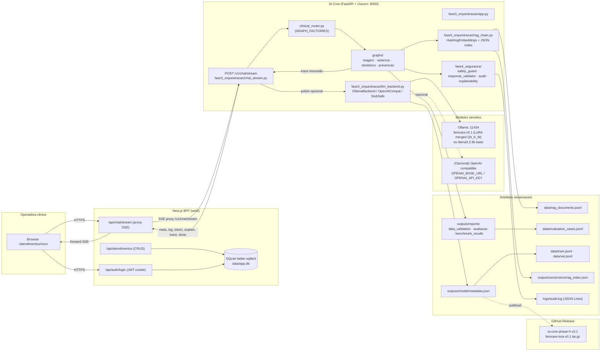
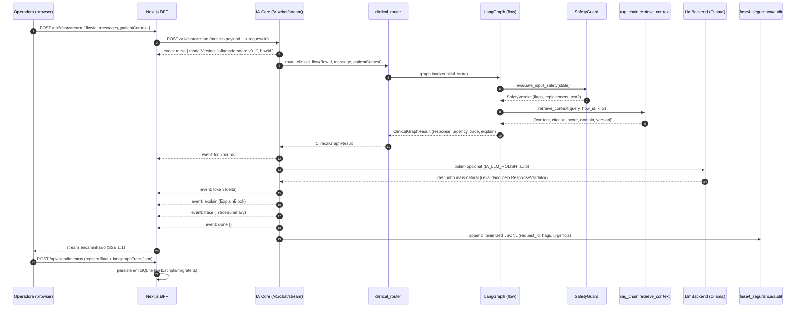
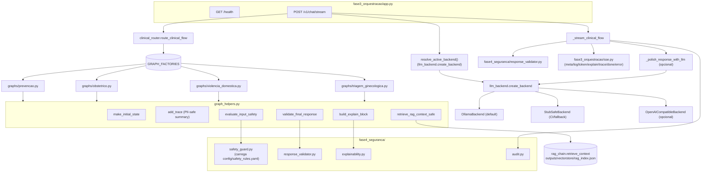
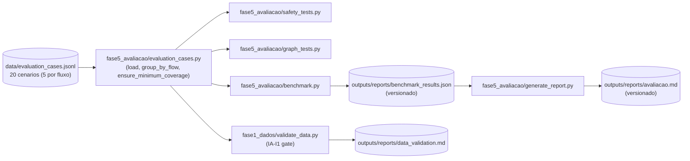

# Diagrama de Arquitetura - FemCare IA Core

Este documento consolida a arquitetura **final** entregue, refletindo o código versionado em `main` e não apenas a planta original do SDD ([`docs/sdd/ia-core/design.md`](sdd/ia-core/design.md)). Cada bloco do diagrama aponta para os ficheiros reais que o implementam.

Documentos irmãos:

- [`CHECKLIST_FASE3.md`](../CHECKLIST_FASE3.md) - mapa de evidências.
- [`docs/diagramas_fluxos.md`](diagramas_fluxos.md) - os quatro grafos LangGraph.
- [`docs/relatorio_tecnico.md`](relatorio_tecnico.md) - relatório técnico completo.
- [`docs/api.md`](api.md) - contrato HTTP normativo BFF ↔ IA Core.

## 1. Visão de processos (deployed components)



## 2. Fluxo de uma requisição clínica (sequência real)



## 3. Componentes do IA Core (módulos Python)



Notas sobre o diagrama acima:

- O **polish via LLM** é controlado por `IA_LLM_POLISH` (`auto`/`0`/`off`). Quando ativo, a saída do LangGraph passa por `LlmBackend.generate()`, é **revalidada** pelo `ResponseValidator` e cai de volta no rascunho determinístico em caso de timeout, erro de provider ou violação de regra. Implementação em [`fase3_orquestracao/chat_stream.py`](../fase3_orquestracao/chat_stream.py) (`_polish_response_with_llm`).
- O `OllamaBackend` normaliza `OLLAMA_BASE_URL` para garantir o sufixo `/v1` ([`fase3_orquestracao/llm_backend.py`](../fase3_orquestracao/llm_backend.py) `_ensure_openai_compat_suffix`).
- Safety **não depende exclusivamente do LLM**: as regras YAML são compiladas e aplicadas antes (input) e depois (output) da geração.

## 4. Pipelines de dados e fine-tuning

```mermaid
flowchart LR
  kaggle[(Kaggle MedQuAD<br/>pythonafroz/medquad-medical-question-answer-for-ai-research)] -->|"kagglehub.dataset_download"| dl["fase1_dados/download_medquad.py"]
  dl --> raw[("data/raw/medquad/<br/>(local cache, .gitignored)")]
  raw --> explore["fase1_dados/explore_dataset.py"]
  raw --> norm["fase1_dados/build_dataset.py<br/>(normaliza + classifica dominio)"]
  norm --> normalized[("data/processed/<br/>medquad_normalized.jsonl")]
  synthetic[("data/synthetic/<br/>womens_health_curated.jsonl<br/>(versionado)")] --> norm
  norm --> rag_doc[("data/rag_documents.jsonl<br/>13 355 docs")]
  norm --> train[("data/train.jsonl · data/val.jsonl<br/>2 231 / 557")]

  rag_doc --> indexer["fase3_orquestracao/rag_chain.py --build"]
  indexer --> vec[("outputs/vectorstore/rag_index.json<br/>HashingEmbeddings 768-d")]

  train --> trainer["fase2_finetuning/train_lora.py<br/>(TRL + LoRA, MPS auto-detected)"]
  trainer --> adapter[("outputs/model/adapter_model.safetensors<br/>(13 MB, fora do git)")]
  trainer --> meta[("outputs/model/metadata.json<br/>(versionado)")]
  adapter --> merge["fase2_finetuning/merge_and_export.py"]
  merge --> gguf[("femcare-lora-v0.1.tar.gz<br/>Q4_K_M, 807 MB")]
  gguf --> release[("GitHub Release<br/>ia-core-phase-h-v0.1")]
  release --> ollamaImport["ollama create femcare:v0.1<br/>(Modelfile)"]
  ollamaImport --> ollama[("Ollama runtime :11434<br/>femcare:v0.1")]
  ollama -.consumido por.-> backend["fase3_orquestracao/llm_backend.OllamaBackend"]
```



Pontos a destacar:

- `data/raw/medquad/` está em `.gitignore`. Apenas hashes (sha256) dos splits ficam em [`outputs/model/metadata.json`](../outputs/model/metadata.json).
- O pipeline aceita modo **sintético-only** (`python fase1_dados/build_dataset.py --synthetic-only`) para validar contrato sem credenciais Kaggle.
- A coluna `mode` em `metadata.json` distingue **dry_run** (sem GPU) de **trained** (treino real); a entrega usa `mode=trained`.

## 5. Pipeline de avaliação automatizada (Fase I)



O benchmark pode operar **in-process** (default, sem servidor) ou **via HTTP** contra o IA Core em execução:

```bash
ORCHESTRATION_API_URL=http://127.0.0.1:8000 \
python fase5_avaliacao/benchmark.py --via-http
```

Isso valida o contrato SSE de IA-G1 end-to-end (parsing de `meta/explain/trace/done`).

## 6. Mapa de variáveis de ambiente

| Variável | Componente | Default | Função |
|---|---|---|---|
| `AUTH_SECRET` | BFF Next.js | (obrigatória em prod) | Assina JWT do cookie `mw_session` |
| `DATABASE_PATH` | BFF Next.js | `data/app.db` | Local do SQLite |
| `ORCHESTRATION_API_URL` | BFF | (vazio) | URL do IA Core. Vazio = modo `stub` |
| `ORCHESTRATION_API_KEY` | BFF | (vazio) | Bearer opcional |
| `IA_LLM_BACKEND` | IA Core | `ollama` | Seleciona backend (`ollama`/`openai_compatible`/`stub_safe`) |
| `IA_LLM_POLISH` | IA Core | `auto` | Liga o polish via LLM real (`0` desliga) |
| `IA_LLM_POLISH_TIMEOUT_S` | IA Core | `45` | Timeout do polish |
| `IA_LLM_POLISH_TEMPERATURE` | IA Core | `0.2` | Temperatura do polish |
| `OLLAMA_BASE_URL` | IA Core | `http://127.0.0.1:11434/v1` | Aceita versões com ou sem `/v1` |
| `OLLAMA_MODEL` | IA Core | `llama3.2:3b` (demo: `femcare:v0.1`) | Modelo Ollama servido |
| `OLLAMA_API_KEY` | IA Core | `ollama` | Token simbólico aceito pelo Ollama |
| `OPENAI_BASE_URL` / `OPENAI_API_KEY` / `OPENAI_MODEL` | IA Core | (vazio) | Backend opcional |

## 7. Como o diagrama se mantém alinhado ao código

Sempre que um destes pontos mudar, este documento precisa ser atualizado:

- Novos nós ou transições nos grafos (`fase3_orquestracao/graphs/*.py`).
- Nova regra de safety em `config/safety_rules.yaml`.
- Mudança no contrato SSE (`fase3_orquestracao/chat_stream.py` + [`docs/api.md`](api.md)).
- Inclusão de um backend extra em `fase3_orquestracao/llm_backend.py`.
- Nova etapa no pipeline de dados (`fase1_dados/`) ou fine-tuning (`fase2_finetuning/`).

Tarefas Phase-J (SDD) garantem que o diagrama é parte do `Definition of Done` de cada mudança estrutural.
