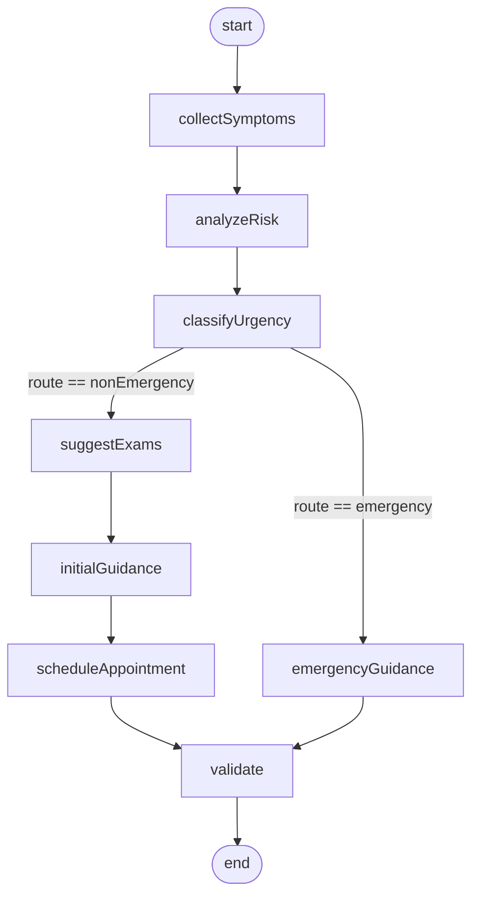
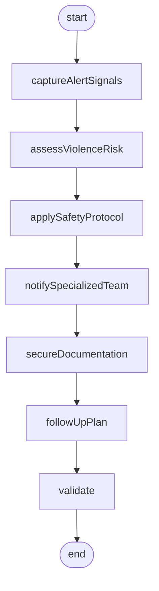
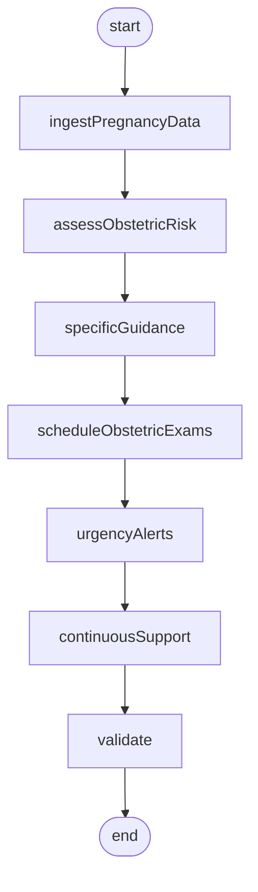
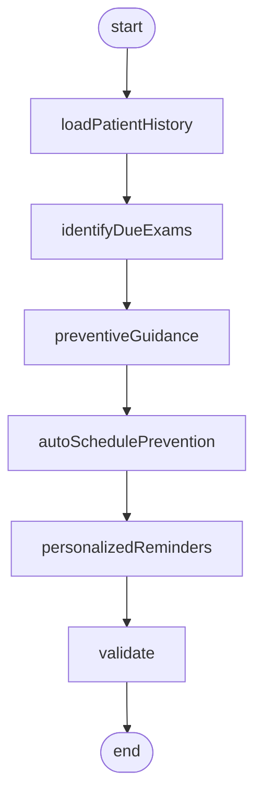

# Diagramas dos Fluxos LangGraph - FemCare IA Core

Os quatro diagramas abaixo representam **o código real** versionado em [`fase3_orquestracao/graphs/`](../fase3_orquestracao/graphs/). Cada nó tem o mesmo nome usado no `StateGraph`, em `add_node(...)`, para facilitar a auditoria. As transições conferem com as chamadas `add_edge` / `add_conditional_edges`.

Documentos relacionados:

- [`docs/diagrama_arquitetura.md`](diagrama_arquitetura.md) - visão sistêmica.
- [`docs/relatorio_tecnico.md` §5](relatorio_tecnico.md#5-capacidades-clinicas-implementadas) - racional clínico.
- [`fase3_orquestracao/clinical_router.py`](../fase3_orquestracao/clinical_router.py) - roteamento por `flowId`.
- [`config/safety_rules.yaml`](../config/safety_rules.yaml) - regras YAML aplicadas dentro dos grafos.
- [`fase3_orquestracao/graph_helpers.py`](../fase3_orquestracao/graph_helpers.py) - helpers compartilhados (trace, RAG seguro, validate_final_response).

## Estado compartilhado (`ClinicalGraphState`)

Todos os grafos manipulam o mesmo `TypedDict` definido em [`fase3_orquestracao/graph_helpers.py`](../fase3_orquestracao/graph_helpers.py). Os campos mais relevantes para auditoria:

| Campo | Origem | Uso |
|---|---|---|
| `flow_id` | router | Identifica o grafo. |
| `user_input` | request | Mensagem clínica. |
| `patient_context` | request | `obstetrica`, `preventivos`, `cicloMenstrual`, etc. |
| `safety_flags` | `SafetyGuard` | Lista de flags acumuladas. |
| `input_verdict` | `evaluate_input_safety` | `SafetyVerdict` opcional. |
| `rag_results` | `retrieve_rag_context_safe` | Fontes recuperadas. |
| `output_parts` | nós do grafo | Strings concatenadas pelo `append_output`. |
| `final_response` | `validate_final_response` | Texto final após guardrails. |
| `final_risk` / `urgency` | nós do grafo | `nenhuma`, `moderada`, `alta`, `emergencia`. |
| `route` | classificadores | `emergency` ou `nonEmergency`. |
| `trace` | `add_trace` | Lista de `{name, status, summary, safety_flags}` sem PII. |
| `explain` | `build_explain_block` | `fonte`, `confianca`, `lacunas`, `raciocinioClinico`. |

## 1. Triagem ginecológica (`triagemGinecologica`)

Arquivo: [`fase3_orquestracao/graphs/triagem_ginecologica.py`](../fase3_orquestracao/graphs/triagem_ginecologica.py).



### Estados (com referência direta ao código)

| Nó | Função | O que faz | Safety flags possíveis |
|---|---|---|---|
| `collectSymptoms` | `collect_symptoms` | Normaliza sintomas via regex (dor pélvica, sangramento, corrimento, febre, ciclo). Aciona `evaluate_input_safety` na entrada. | (depende do input) |
| `analyzeRisk` | `analyze_risk` | Acumula fatores de risco via `alarm_hits("bleeding", "pain", "self_harm")`. | `safety:blocking_input` se input bloqueado. |
| `classifyUrgency` | `classify_urgency` | Define `urgency` (`moderada`/`alta`/`emergencia`) e `route`. | `urgent_referral`, `human_review_required`, `self_harm_escalation`. |
| `suggestExams` | `suggest_exams` | RAG seguro (k=3) + sugestões (citopatológico, avaliação de corrimento). | - |
| `initialGuidance` | `initial_guidance` | Orientação conservadora **sem prescrição**. | - |
| `scheduleAppointment` | `schedule_appointment` | Define prioridade `prioritaria` (urgency=alta) ou `rotina`. | - |
| `emergencyGuidance` | `emergency_guidance` | Mensagem "Procure pronto atendimento ... 192 (SAMU)". | `urgent_referral`, `human_review_required`. |
| `validate` | `validate_final_response` | Aplica `ResponseValidator` no texto final. | Pode adicionar `prescription_blocked` ou `definitive_diagnosis_blocked`. |

Regra crítica (IA-LG-01 + IA-SAFE-02): sintomas de alarme (`dor no peito`, `sangramento intenso`, `desmaiei`, etc.) acionam `clinical_emergency` em [`config/safety_rules.yaml`](../config/safety_rules.yaml) e desviam para `emergencyGuidance`.

## 2. Violência doméstica (`violenciaDomestica`)

Arquivo: [`fase3_orquestracao/graphs/violencia_domestica.py`](../fase3_orquestracao/graphs/violencia_domestica.py).



### Estados

| Nó | Função | O que faz | Safety flags |
|---|---|---|---|
| `captureAlertSignals` | `capture_alert_signals` | `evaluate_input_safety` + reforço de "equipe qualificada" no replacement. | `sensitive` |
| `assessViolenceRisk` | `assess_violence_risk` | Classifica `final_risk=alta`, `urgency=alta` se houver `violence_protocol`. | `human_review_required`, `sensitive` |
| `applySafetyProtocol` | `apply_safety_protocol` | Aplica replacement do `domestic_violence` (Disque 180, Polícia 190, Casa da Mulher Brasileira). | `violence_protocol`, `human_review_required`, `sensitive` |
| `notifySpecializedTeam` | `notify_specialized_team` | Marca `specialized_team_notified=True` e acrescenta encaminhamento. | `human_review_required`, `sensitive` |
| `secureDocumentation` | `secure_documentation` | Seta `audit_summary={"sensitive_redacted": True, "summary": "[REDACTED:sensitive_content]"}`. | `sensitive` |
| `followUpPlan` | `follow_up_plan` | Plano: contato seguro, evitar mensagens, atendimento presencial protegido. | `human_review_required`, `sensitive` |
| `validate` | `validate_final_response` | Validação final + redação extra se necessário. | (acumulativa) |

Regra crítica (IA-LG-02 + IA-AUD-01): este fluxo **não persiste texto livre sensível**. Veja [`fase4_seguranca/audit.py`](../fase4_seguranca/audit.py) (`redact_text` + `audit_summary`).

## 3. Obstétrico (`obstetrico`)

Arquivo: [`fase3_orquestracao/graphs/obstetrico.py`](../fase3_orquestracao/graphs/obstetrico.py).



### Estados

| Nó | Função | O que faz | Sinais detectados |
|---|---|---|---|
| `ingestPregnancyData` | `ingest_pregnancy_data` | Extrai idade gestacional (`\d{1,2}\s*(semanas|sem)`) e funde com `patientContext.obstetrica`. | - |
| `assessObstetricRisk` | `assess_obstetric_risk` | Classifica `urgency` por `alarm_hits("bleeding","pregnancy","pain")` + regex de emergência (sangramento intenso, "não sinto mais o bebê", bolsa rota, convulsão, pressão muito alta). | Risco `moderada` / `alta` / `emergencia`. |
| `specificGuidance` | `specific_guidance` | RAG seguro (k=3); orientação imediata se urgência alta/emergência. | - |
| `scheduleObstetricExams` | `schedule_obstetric_exams` | Lista exames (pré-natal + sinais vitais ou avaliação obstétrica imediata). | - |
| `urgencyAlerts` | `urgency_alerts` | Em `alta`/`emergencia`, dispara `urgent_referral`, `human_review_required`. | `urgent_referral` |
| `continuousSupport` | `continuous_support` | Define `appointment_priority` (`imediato` ou `rotina`). | - |
| `validate` | `validate_final_response` | ResponseValidator no texto consolidado. | - |

Regra crítica (IA-LG-03): qualquer sinal de alarme gestacional eleva urgência para `alta` ou `emergencia` e força encaminhamento.

## 4. Prevenção e rastreamento (`prevencao`)

Arquivo: [`fase3_orquestracao/graphs/prevencao.py`](../fase3_orquestracao/graphs/prevencao.py).



### Estados

| Nó | Função | O que faz | Diferenciação |
|---|---|---|---|
| `loadPatientHistory` | `load_patient_history` | `evaluate_input_safety` + idade detectada por regex (`\d{2} anos`) é mesclada em `patient_context.preventivos`. | - |
| `identifyDueExams` | `identify_due_exams` | Classifica em **rastreamento rotineiro** vs **alto risco** (`alto risco`, `historia familiar`, `imunossuprim`) vs **sintomático** (`sangramento`, `dor`, `caroço`, `nódulo`). | `urgency = moderada` se sintomático/alto risco, senão `nenhuma`. |
| `preventiveGuidance` | `preventive_guidance` | RAG seguro (k=3); orientação separando os três cenários acima. | - |
| `autoSchedulePrevention` | `auto_schedule_prevention` | `prioritaria` (urgency=moderada) ou `rotina`. | - |
| `personalizedReminders` | `personalized_reminders` | 3 lembretes seguros (exames anteriores, DUM, retorno se piora). | - |
| `validate` | `validate_final_response` | ResponseValidator (bloqueia "prescrição" se a paciente perguntar anticoncepcional). | `prescription_blocked` quando aplicável. |

Regra crítica (IA-LG-04): a UI deve **não confundir** rastreamento populacional com investigação por sintoma; o grafo separa os ramos em `identifyDueExams` antes de gerar texto.

## Como cada grafo é exercido em testes

Os quatro fluxos são percorridos no gate da Fase F (`pytest tests/test_graphs.py`) e na Fase I (5 casos por fluxo em [`data/evaluation_cases.jsonl`](../data/evaluation_cases.jsonl)). Para reproduzir manualmente:

```bash
# Um fluxo de cada vez
python fase5_avaliacao/graph_tests.py --flow triagemGinecologica
python fase5_avaliacao/graph_tests.py --flow violenciaDomestica
python fase5_avaliacao/graph_tests.py --flow obstetrico
python fase5_avaliacao/graph_tests.py --flow prevencao

# Tudo de uma vez (default Fase I)
python fase5_avaliacao/graph_tests.py
```

O relatório consolidado fica em [`outputs/reports/avaliacao.md`](../outputs/reports/avaliacao.md) e o JSON bruto em [`outputs/reports/benchmark_results.json`](../outputs/reports/benchmark_results.json).
