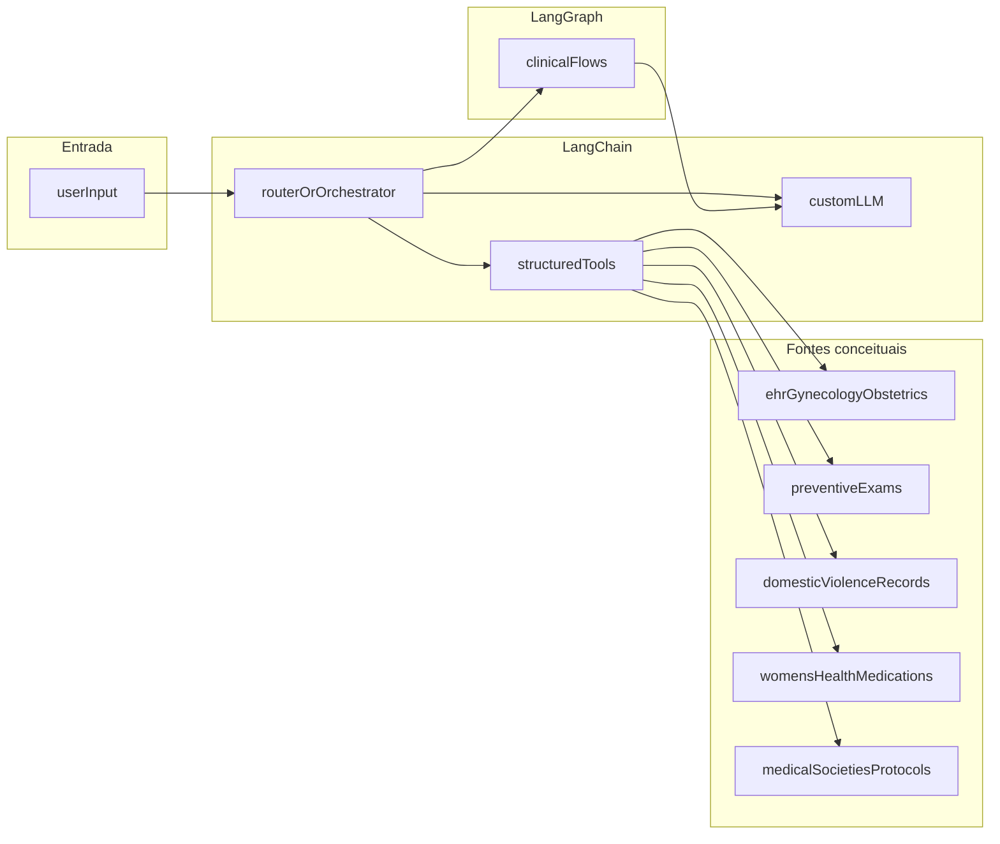

# LangChain e integração

**Documento oficial:** PDF Secretaria — item **2** (p. 4–5), *Criação de assistente médico especializado com LangChain*.  
Requisitos correspondentes: **RF-LC-01** … **RF-LC-06** em [01-requisitos-funcionais.md](01-requisitos-funcionais.md).  
Este documento define **interfaces conceituais** e responsabilidades; implementação fica para o SDD.

## 1. Objetivo da camada LangChain

Orquestrar:

1. Chamadas ao **LLM fine-tuned** (núcleo de linguagem especializada).
2. **Ferramentas** de acesso a dados estruturados e fontes de protocolo (via adaptadores).
3. **Memória / contexto** da sessão e da paciente (quando autorizado).
4. Encaminhamento para **LangGraph** nos quatro fluxos clínicos obrigatórios.

## 2. Contratos conceituais (adaptadores)

Cada fonte deve expor operações mínimas documentadas no SDD (nomes ilustrativos):

| Fonte | Operações mínimas sugeridas | Observações |
|-------|----------------------------|---------------|
| Prontuário GO | `getEncounterSummary`, `listActiveConditions`, `getObstetricHistory` | RF-LC-02; dados sensíveis. |
| Preventivos | `getScreeningStatus`, `listOverdueExams` | RF-LC-05 alertas. |
| Violência | `appendSecureNote`, `getRiskFlags` (com RBAC) | Protocolo de segurança obrigatório. |
| Medicamentos | `searchDrugInfo`, `checkInteractions` (TBD) | Não substituir prescrição validada. |
| Protocolos / sociedades | `fetchGuidelineSnippet`, `listCitations` | RF-LC-06: protocolos atualizados de sociedades médicas especializadas; suporte a RF-SEC-04 (fontes). |

## 3. Contextualização da paciente

- Entrada opcional: identificador interno, resumo clínico estruturado, **calendário menstrual**, histórico reprodutivo.
- O sistema **não deve** inferir fatos não presentes nos dados fornecidos (alucinação clínica = falha de segurança).

## 4. Integração com calendário menstrual e histórico reprodutivo

- **Entrada:** datas de ciclo, sintomas correlatos, gestações anteriores (exemplos no dataset sintético).
- **Saída:** respostas e sugestões condicionadas a esse contexto (ex.: janela de fertilidade apenas se escopo aprovado no SDD).

## 5. Relação LangChain ↔ LangGraph

- LangGraph implementa os **macro-fluxos** ([05-langgraph-fluxos.md](05-langgraph-fluxos.md)).
- LangChain fornece **chains/tools** reutilizáveis invocados como nós ou subgrafos (decisão de composição no SDD).

---

## Open questions para SDD

- Framework de **autenticação** entre orquestrador e adaptadores.
- Padrão de mensagens (**LangChain LCEL** vs legado).
- Uso de **LangSmith** ou equivalente para traços e avaliação.
- Estratégia de **cache** de embeddings ou de respostas de protocolo.
