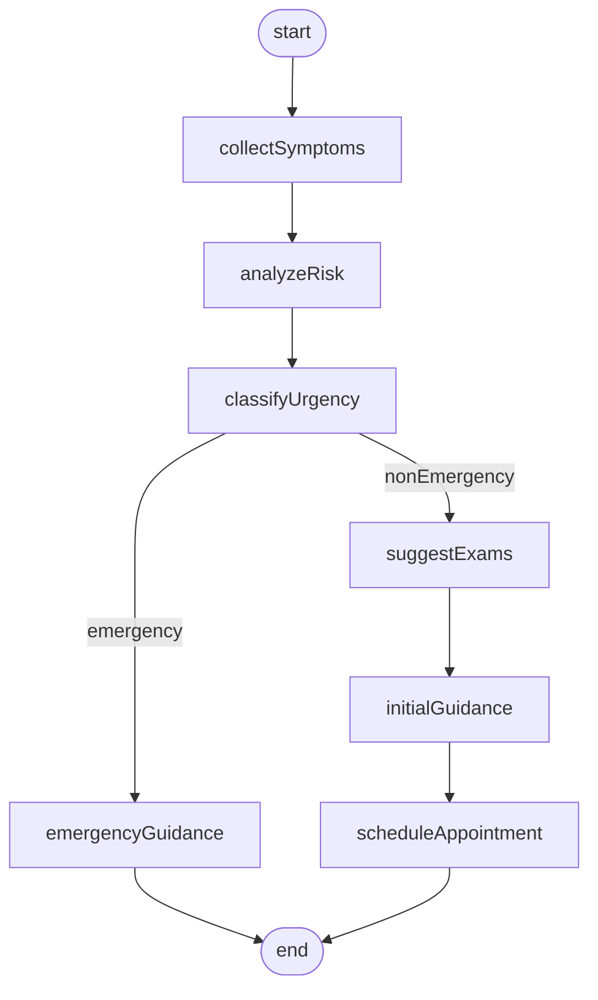
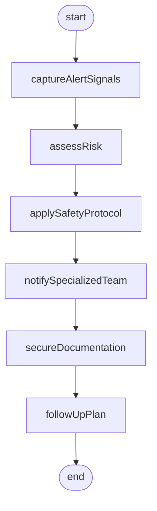
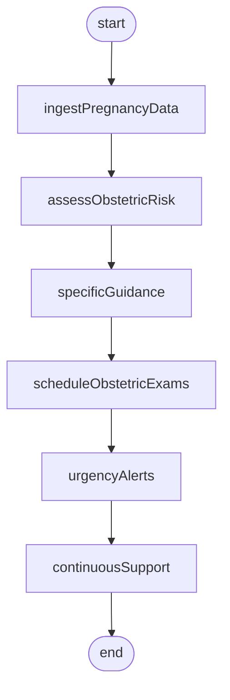
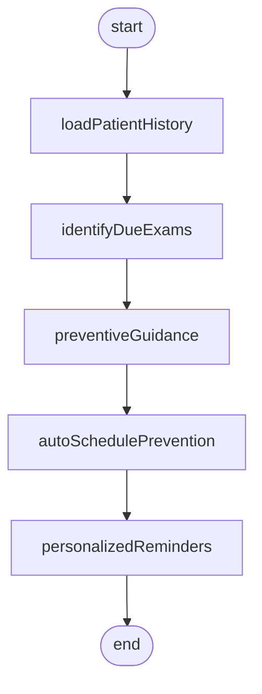
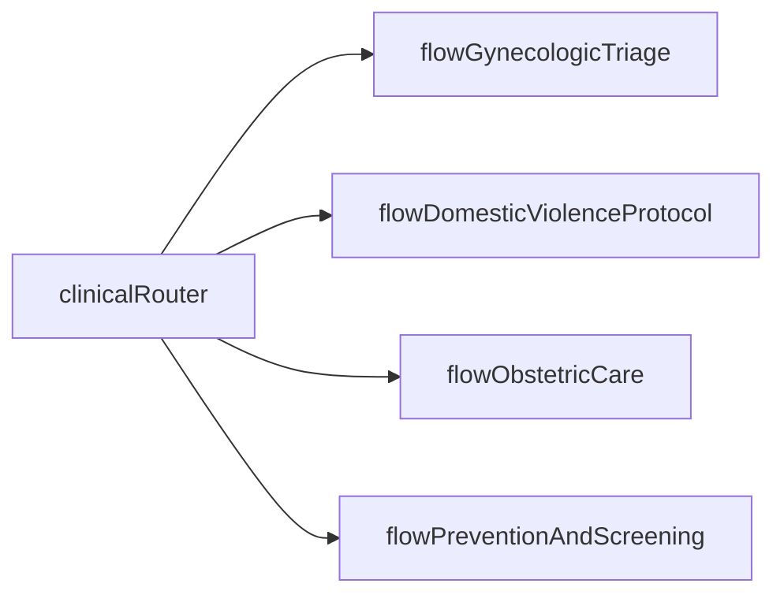

# LangGraph — fluxos de atendimento especializado

**Documento oficial:** PDF Secretaria — item **3** (p. 5–6): *“Criação de cada fluxo de atendimento descritos abaixo utilizando LangGraph e os dados relevantes para cada um”*.  
Requisitos: **RF-LG-00** … **RF-LG-04** em [01-requisitos-funcionais.md](01-requisitos-funcionais.md).

Cada fluxo é uma **máquina de estados** com entradas, saídas, transições e guardas conceituais. IDs de estado em **camelCase** coincidem com os diagramas Mermaid (rastreio SDD → código).

### Dados relevantes por fluxo (RF-LG-00)

O enunciado exige LangGraph **e** dados pertinentes a cada cenário. No SDD, manter matriz **fluxo → fontes de dados** (prontuário, preventivos, sinais de violência, dados obstétricos, histórico de rastreamento), ainda que via **mocks** versionados.

---

## Fluxo 1 — Triagem ginecológica

**ID do fluxo:** `flowGynecologicTriage`

### Cadeia do PDF

Sintomas relatados → Análise de risco → Classificação de urgência → Sugestão de exames → Orientações iniciais → Agendamento apropriado

### Estados

| Estado | Descrição | Entrada principal | Saída |
|--------|-------------|-------------------|--------|
| `collectSymptoms` | Coleta e normalização de sintomas. | Texto/estrutura clínica. | Perfil sintomático. |
| `analyzeRisk` | Modelo + regras para estimativa de risco. | Perfil sintomático, sinais vitais se houver. | Score ou categoria de risco. |
| `classifyUrgency` | Mapeamento para nível de urgência (ex.: não urgente, prioritário, emergência). | Categoria de risco. | Nível de urgência. |
| `suggestExams` | Lista de exames sugeridos alinhada a protocolos. | Urgência + contexto. | Lista justificada + fontes. |
| `initialGuidance` | Orientações seguras e não definitivas. | Exames + sintomas. | Texto orientativo + disclaimers. |
| `scheduleAppointment` | Sugestão de tipo de consulta/procedimento e janela. | Urgência + disponibilidade (TBD). | Pedido de agendamento ou instruções. |

### Guardas conceituais

- De `classifyUrgency`: se **emergência**, atalho para orientação de **busca imediata** (presencial/urgência) antes de agendamento eletivo.
- Todo texto clínico passa por **validação pré-retorno** (RF-SEC-02).

### Diagrama

---

## Fluxo 2 — Detecção de violência doméstica

**ID do fluxo:** `flowDomesticViolenceProtocol`

### Cadeia do PDF

Sinais de alerta → Avaliação de risco → Protocolo de segurança → Acionamento de equipe especializada → Documentação segura → Seguimento

### Estados

| Estado | Descrição | Entrada principal | Saída |
|--------|-------------|-------------------|--------|
| `captureAlertSignals` | Linguagem e sinais de alerta (com consentimento implícito de uso em ambiente clínico). | Mensagens, formulário estruturado. | Sinalizadores normalizados. |
| `assessRisk` | Avaliação de risco (inclui gravidade e imediatismo). | Sinais + contexto. | Nível de risco. |
| `applySafetyProtocol` | Passos de segurança (ex.: não expor plano de fuga em canal inseguro — TBD UX). | Nível de risco. | Plano de segurança interno. |
| `notifySpecializedTeam` | Acionar equipe (gineco, psicologia, assistência social, segurança). | Risco alto/crítico. | Registro de notificação (auditoria). |
| `secureDocumentation` | Escrita em canal cifrado / repositório segregado. | Notas clínicas sensíveis. | ID de registro seguro. |
| `followUpPlan` | Plano de seguimento e próximos contatos seguros. | Registro + equipe acionada. | Cronograma e responsáveis. |

### Guardas conceituais

- **Confidencialidade absoluta** (RF-SEC-01); logs específicos sem vazamento de conteúdo (RF-SEC-03).
- Nunca encerrar sem **encaminhamento humano** quando risco detectado.

### Diagrama

---

## Fluxo 3 — Obstétrico

**ID do fluxo:** `flowObstetricCare`

### Cadeia do PDF

Dados da gestante → Avaliação de risco gestacional → Orientações específicas → Agendamento de exames → Alertas de urgência → Acompanhamento contínuo

### Estados

| Estado | Descrição | Entrada principal | Saída |
|--------|-------------|-------------------|--------|
| `ingestPregnancyData` | Dados gestacionais (IG, comorbidades, histórico). | Prontuário/resumo. | Modelo interno da gestação. |
| `assessObstetricRisk` | Classificação de risco (ex.: baixo/alto). | Dados gestacionais. | Estratificação. |
| `specificGuidance` | Orientações por trimestre/risco. | Estratificação. | Pacote de orientações citadas. |
| `scheduleObstetricExams` | Exames e retornos sugeridos. | IG + guideline. | Lista de exames com prazos. |
| `urgencyAlerts` | Alertas para sinais de alarme (pré-eclâmpsia, sangramento etc.). | Sintomas novos ou dados vitais. | Alertas + escalação. |
| `continuousSupport` | Loop ou reentrada para acompanhamento (TBD frequência). | Estado da gestação. | Próximos check-ins sugeridos. |

### Diagrama

---

## Fluxo 4 — Prevenção

**ID do fluxo:** `flowPreventionAndScreening`

### Cadeia do PDF

Histórico da paciente → Identificação de exames devidos → Orientações preventivas → Agendamento automático → Lembretes personalizados

### Estados

| Estado | Descrição | Entrada principal | Saída |
|--------|-------------|-------------------|--------|
| `loadPatientHistory` | Histórico preventivo e fatores de risco. | Prontuário/resumo. | Linha do tempo de rastreio. |
| `identifyDueExams` | Regras por idade, guideline, últimos exames. | Linha do tempo. | Lista “devidos agora”. |
| `preventiveGuidance` | Educação em saúde e mitigação de barreiras. | Exames devidos. | Conteúdo personalizado. |
| `autoSchedulePrevention` | Criação de pedidos/janelas (mock aceitável). | Lista devidos. | Agendamentos propostos. |
| `personalizedReminders` | Lembretes por canal (TBD) e cadência. | Agendamentos. | Plano de lembretes. |

### Diagrama

---

## Visão integrada (opcional no SDD)

---

## Open questions para SDD

- **Human-in-the-loop** obrigatório em quais transições (especialmente `notifySpecializedTeam`).
- Modelo de **estado persistente** (checkpoint LangGraph, BD, ambos).
- Reuso de subgrafos (ex.: `urgencyAlerts` compartilhado entre triagem e obstétrico).
- Internacionalização (pt-BR apenas vs multilíngue).
